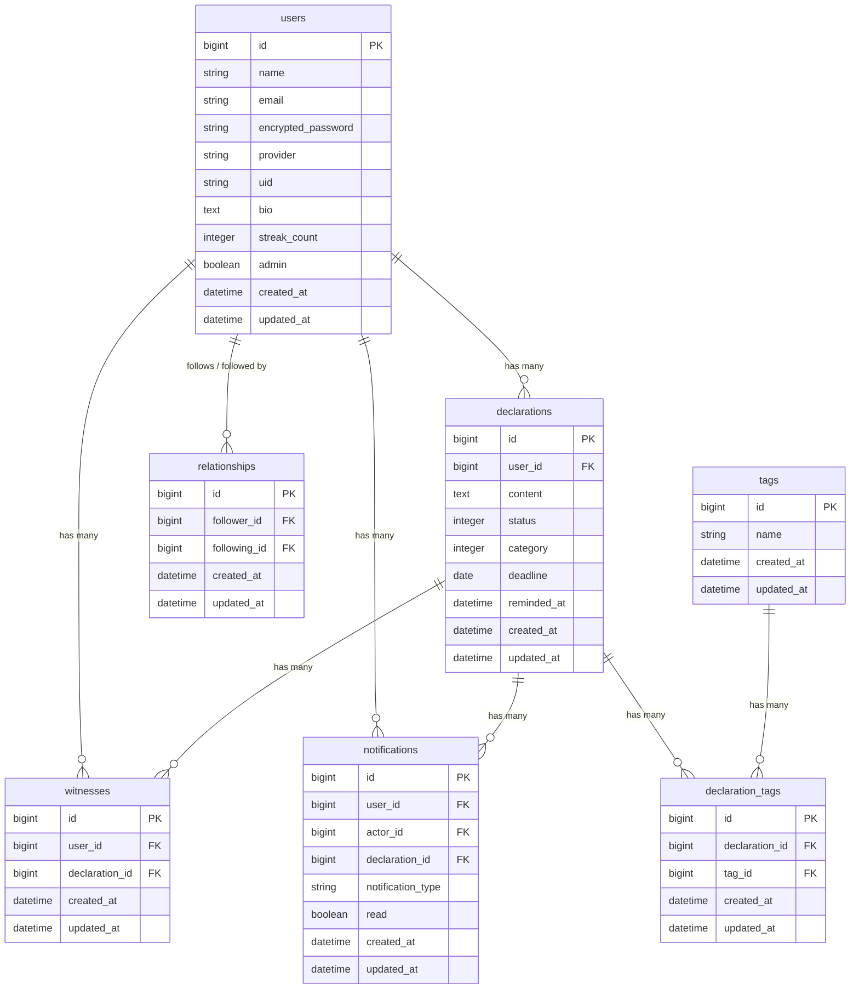

# 宣言効果

### 「宣言効果」という心理学を用いた宣言特化型SNS

  

## サービスURL

https://sengen-kouka.com/

## サービス概要

「宣言効果」は、**宣言することを行動のきっかけにする**習慣化サポートアプリです。

「やろうと思っているのに動けない」という状態を、宣言という行為によって突破します。
目標や今日やることを宣言し、期限・達成報告・継続日数を記録することで、行動の継続と習慣化をサポートします。

## 開発背景

学習をしようと思っても、なかなか体が動かないことがよくありました。

頭の中では「やらなきゃいけない」と思っていても、実際には行動に移せないことが多くありました。

そんな中、Qiitaのアドベントカレンダーを書く機会があり、「宣言効果」という心理学に出会いました。

実際に「1ヶ月毎日Qiita投稿チャレンジ」と宣言したことで、チャレンジを達成することができ、宣言することの力を強く実感しました。

自分自身と同じ悩みを持つ人の「気持ちはあるのに動けない」という課題を、心理学的アプローチで解決したいという思いから、このサービスを開発しました。

## ターゲット層

- プログラミング学習者・スクール生
- 継続したい気持ちはあるものの、疲労や誘惑で後回しにしてしまうことが多い方
- 自宅学習・オンラインスクールなど、周囲の目を意識しにくい環境で学習している方

## 主な機能

### 宣言投稿

カテゴリ・タグ・期限を設定して宣言を投稿できます。
宣言が他ユーザーのタイムラインに表示されることで、外部に宣言した感覚を生み出します。

### 達成報告

宣言の達成報告ができます。達成すると連続達成日数（ストリーク）が加算されます。
期限を過ぎても未達成の宣言は視覚的に区別して表示されます。

### 見届け機能

他ユーザーの宣言に「見届ける」ことができます。
いいねに相当する機能で、宣言者に通知が届き、モチベーション維持に貢献します。

### フォロー機能

ユーザーをフォローすることで、タイムラインにフォロー中ユーザーの宣言が表示されます。
フォロー・フォロワー一覧も確認できます。

### プロフィール

アバター画像・自己紹介文を設定できます。
ユーザーページでは、そのユーザーの宣言一覧・フォロー情報・連続達成日数を確認できます。

### 通知機能

以下のアクションで通知が届きます。

- フォローされたとき
- 宣言を見届けられたとき
- フォロー中ユーザーが宣言を達成したとき

### 検索機能

宣言内容・タグ・ユーザー名でキーワード検索ができます。

### カテゴリ・タグ

カテゴリ（学習・健康・仕事・趣味・生活・その他）とタグで宣言を整理・フィルタリングできます。

## 差別化ポイント

| 既存サービス | 課題 |
|---|---|
| X（旧Twitter） | 宣言以外の情報も流れるためSNS疲れしやすく、達成状況も追いにくい |
| Mattermost times | 個人メモに近く、宣言後の達成報告・継続率の可視化が難しい |
| 習慣管理アプリ | 「毎日続ける」フェーズには強いが、最初の一歩を踏み出すきっかけ作りは弱い |

**宣言に特化した設計で、宣言→達成報告→継続という一連のサイクルをシンプルに回せます。**

## 技術スタック

| 分類 | 技術 |
|---|---|
| 言語 | Ruby 3.x |
| フレームワーク | Ruby on Rails 8.1.3 |
| フロントエンド | Hotwire（Turbo / Stimulus）/ Tailwind CSS |
| データベース | PostgreSQL |
| 認証 | Devise / Google OAuth 2.0 |
| ファイルアップロード | Active Storage |
| 開発環境 | Docker |
| デプロイ | Render |
| テスト | RSpec |
| CI | GitHub Actions |

## 開発フロー

機能ごとにGitHub Issuesでタスクを管理し、Issue単位でブランチを作成して開発しています。

1. Issue作成
2. ブランチ作成
3. 実装
4. Pull Request作成
5. GitHub Actions（RuboCop / RSpec）
6. 確認・修正
7. mainへマージ
8. Renderへ自動デプロイ

## 画面遷移図

https://www.figma.com/design/deiSvOny8qiHVpmsOXXWz7/%E7%84%A1%E9%A1%8C?node-id=0-1&t=1DeytiBDtRe7Z4Ez-1

## ER図

### テーブル詳細

#### usersテーブル
- `name` : 表示名
- `email` : ログイン用メールアドレス
- `provider` / `uid` : Google OAuthログイン用
- `bio` : 自己紹介文
- `streak_count` : 連続達成日数
- `admin` : 管理者フラグ

#### declarationsテーブル
- `content` : 宣言内容
- `status` : `pending(0)` / `completed(1)` / `declaring(2)`
- `category` : `study(0)` / `health(1)` / `work(2)` / `hobby(3)` / `life(4)` / `other(5)`
- `deadline` : 期限日
- `reminded_at` : リマインド送信日時

#### relationshipsテーブル
- `follower_id` : フォローするユーザー
- `following_id` : フォローされるユーザー

#### witnessesテーブル
- 「見届ける」機能の中間テーブル（ユーザーと宣言の多対多）

#### notificationsテーブル
- `notification_type` : `follow` / `witness` / `achievement`
- `actor_id` : 通知を発生させたユーザー
- `read` : 既読フラグ
